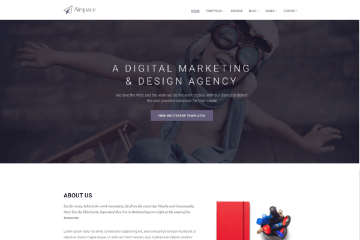
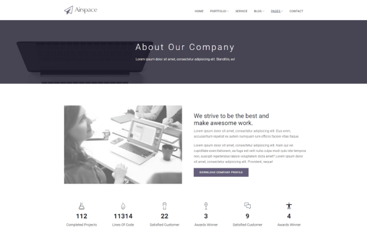
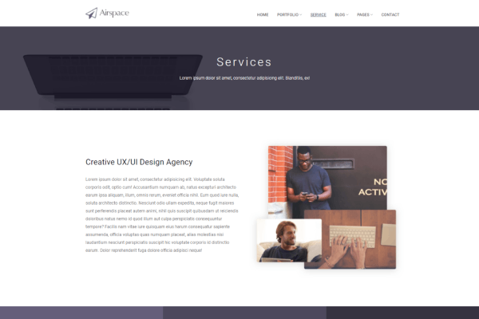
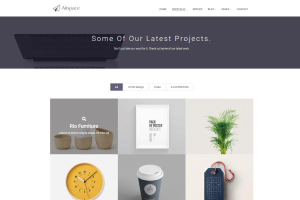
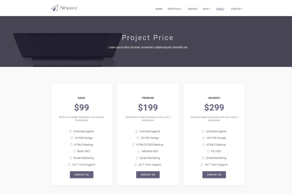
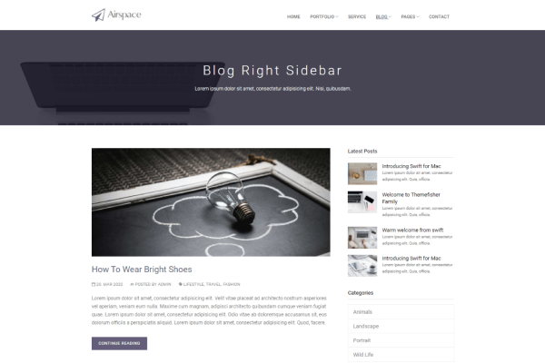
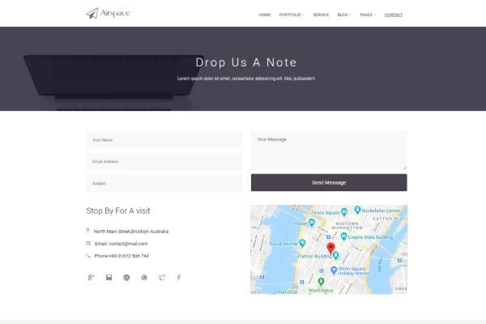
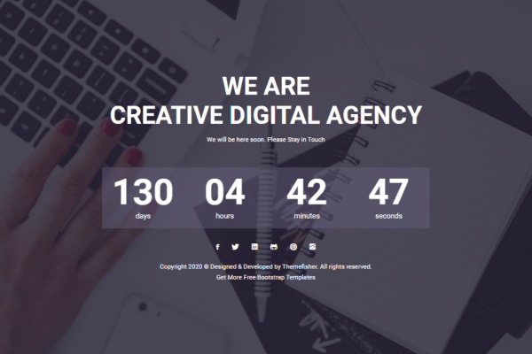
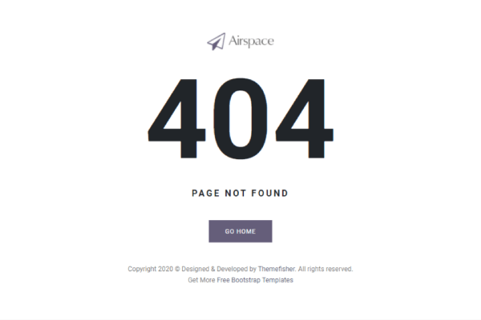

# Airspace By Themefisher
Airspace is a clean, unique, and free bootstrap website template. The template is built with refined business as well as corporate elements and saturated with rich typography, allows to convey perfect message to the first visit according to the niche motto.


<!-- demo -->
## Example Site
| [](https://demo.themefisher.com/themefisher/airspace/) | [](https://demo.themefisher.com/themefisher/airspace/about.html) | [](https://demo.themefisher.com/themefisher/airspace/service.html) |
|:---:|:---:|:---:|
| **Homepage**  | **About**  | **Service**  |
| [](https://demo.themefisher.com/themefisher/airspace/portfolio.html) | [](https://demo.themefisher.com/themefisher/airspace/pricing.html) | [](https://demo.themefisher.com/themefisher/airspace/blog-right-sidebar.html) |
| **Portfolio** | **Pricing** | **Blogs** |
| [](https://demo.themefisher.com/themefisher/airspace/contact.html) | [](https://demo.themefisher.com/themefisher/airspace/coming-soon.html) | [](https://demo.themefisher.com/themefisher/airspace/404.html) |
| **Contact** | **Coming Soon** | **404** |

👉🏻[View Live Preview](https://demo.themefisher.com/themefisher/airspace/)


<!-- download -->
## Download And installation
Download this template from any following options:

* Download from [Github](https://github.com/themefisher/Airspace-Bootstrap-Agency-Template/archive/master.zip)
* Clone the repository: `git clone https://github.com/themefisher/Airspace-Bootstrap-Agency-Template.git`
* Download from [Themefisher](https://themefisher.com/products/airspace-free-bootstrap-website-template/)


<!-- installation -->
### Basic Usage
After downloading template, you can simply edit the HTML and CSS files from the `theme` folder. To preview the changes you make to the code, you can open the index.html file in your web browser.

### Advanced Usage
For advanced usage you have some dependencies to install. Then you can run it on your localhost. You can view the package.json file to see which scripts are included.

#### Install Dependencies
* **Node Installation:** [Install node js](https://nodejs.org/en/download/)
* **Gulp Installation:** Install gulp globally from your terminal 
```
npm install --global gulp-cli
```
Or visit original [docs](https://gulpjs.com/docs/en/getting-started/quick-start)

#### Run Theme
After succesfully install those dependencies, open this theme with any IDE [[VS Code](https://code.visualstudio.com/) recommended], and then open internal terminal of IDE [vs code shortcut <code>ctrl/cmd+\`</code>]

* Install node package modules
```
npm install
```
* Run gulp
```
gulp
```
After that, it will open up a preview of the template in your default browser, watch for changes to core template files, and live reload the browser when changes are saved.

👉🏻 [visit documentation](https://docs.themefisher.com/airspace/)


<!-- reporting issue -->
## Reporting Issues
We use GitHub Issues as the official bug tracker for the Airspace Template. Please Search [existing issues](https://github.com/themefisher/Airspace-Bootstrap-Agency-Template/issues). It’s possible someone has already reported the same problem.
If your problem or idea has not been addressed yet, feel free to [open a new issue](https://github.com/themefisher/Airspace-Bootstrap-Agency-Template/issues).

<!-- support -->
## Technical Support or Questions (Paid)
If you have questions or need help integrating the product please [contact us](mailto:mehedi@themefisher.com) instead of opening an issue.

<!-- licence -->
## License
Copyright &copy; 2021 Designed & Developed by [Themefisher](https://themefisher.com)

**Code License:** Released under the [MIT](https://github.com/themefisher/Airspace-Bootstrap-Agency-Template/blob/master/LICENSE) license.

**Image license:** The images are only for demonstration purposes. They have their own licence, we don't have permission to share those image.

<!-- resources -->
## Resources
Some third-party plugins that we used to build this template. Please check their licence.
* **Bootstrap v4.5**: https://getbootstrap.com/docs/4.5/getting-started/introduction/
* **Jquery v3.5.1**: https://jquery.com/download/
* **Ionicons Icons v2.0**: https://ionicons.com/v2/
* **Google Fonts**: http://fonts.google.com/
* **Animate CSS**: https://animate.style/
* **Magnific Popup**: https://dimsemenov.com/plugins/magnific-popup/
* **Slick**: https://kenwheeler.github.io/slick/
* **Shuffle**: https://vestride.github.io/Shuffle/
* **SyoTimer**: http://syomochkin.xyz/folio/syotimer/demo.html